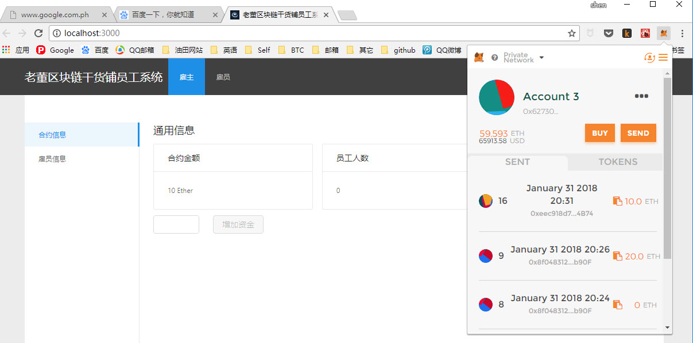
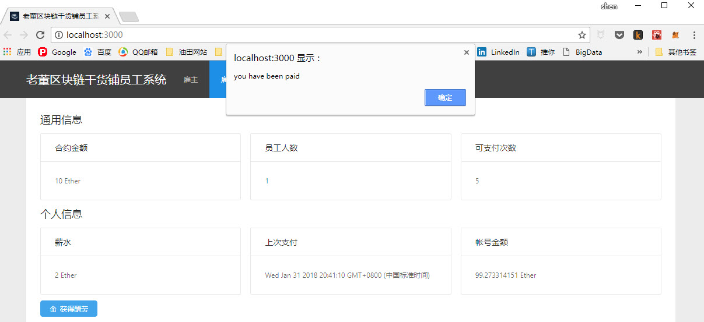
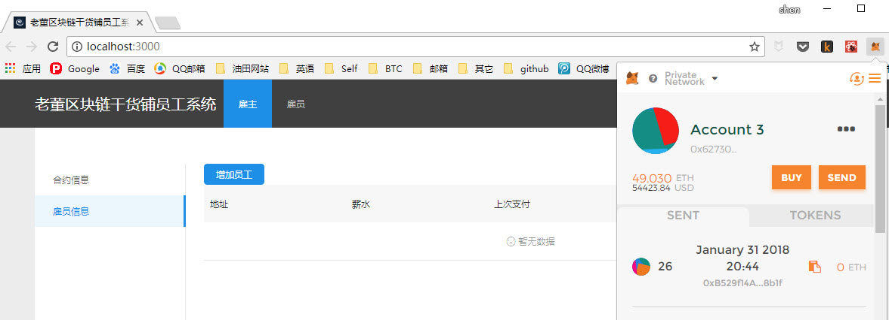

## 硅谷live以太坊智能合约 第六课作业
20 申龙斌 

增加10eth


增加员工


取工资


删除员工



### payroll.sol
加了几个event，以前几次试验不通过，是因为代码没有抄正确。

```
  event NewEmployee (
      address employee
    );

    event UpdateEmployee (
      address employee
    );

    event RemoveEmployee (
      address employee
    );
        
    event NewFund (
      uint balance
    );
  
    event GetPaid (
      address employee
    );
```

函数里面加上调用语句。
```
   function addEmployee(address employeeId, uint salary) onlyOwner {
        var employee = employees[employeeId];
        assert(employee.id == 0x0);

        employees[employeeId] = Employee(employeeId, salary.mul(1 ether), now);
        totalSalary = totalSalary.add(employees[employeeId].salary);
        totalEmployee = totalEmployee.add(1);
        employeeList.push(employeeId);
        NewEmployee(employeeId);
    }
    
    function removeEmployee(address employeeId) onlyOwner employeeExit(employeeId) {
        var employee = employees[employeeId];

        _partialPaid(employee);
        totalSalary = totalSalary.sub(employee.salary);
        delete employees[employeeId];
        totalEmployee = totalEmployee.sub(1);
        RemoveEmployee(employeeId);
    }
    
    function updateEmployee(address employeeId, uint salary) onlyOwner employeeExit(employeeId) {
        var employee = employees[employeeId];

        _partialPaid(employee);
        totalSalary = totalSalary.sub(employee.salary);
        employee.salary = salary.mul(1 ether);
        employee.lastPayday = now;
        totalSalary = totalSalary.add(employee.salary);
        UpdateEmployee(employeeId);
    }
    
    function addFund() payable returns (uint) {
        NewFund(this.balance);
        return this.balance;
    }
    
    
        function getPaid() employeeExit(msg.sender) {
        var employee = employees[msg.sender];

        uint nextPayday = employee.lastPayday.add(payDuration);
        assert(nextPayday < now);

        employee.lastPayday = nextPayday;
        employee.id.transfer(employee.salary);
        GetPaid(employee.id);
    }
```

### 组件里的common.js
```
  componentDidMount() {
    const { payroll, web3 } = this.props;
    const updateInfo = (error, result) => {
      if (!error) {
        this.checkInfo();
      }
    }

    this.newFund = payroll.NewFund(updateInfo);
    this.getPaid = payroll.GetPaid(updateInfo);
    this.newEmployee = payroll.NewEmployee(updateInfo);
    this.updateEmployee = payroll.UpdateEmployee(updateInfo);
    this.removeEmployee = payroll.RemoveEmployee(updateInfo);

    this.checkInfo();
  }

  checkInfo = () => {
    const { payroll, account, web3 } = this.props;
    payroll.checkInfo.call({
      from: account,
    }).then((result) => {
      this.setState({
        balance: web3.fromWei(result[0].toNumber()),
        runway: result[1].toNumber(),
        employeeCount: result[2].toNumber()
      })
    });
  }


```

### employee.js

```

  checkEmployee = () => {
    // error:     const {payroll, employee, web3 } = this.props;
    const {payroll, account, web3 } = this.props;
    payroll.employees.call(account, {
      from : account,
      /* gas : 1000000 */
    }).then((result) => {
      console.log(result);
      this.setState({
        salary: web3.fromWei(result[1].toNumber()),
        lastPaidDate: new Date(result[2].toNumber()*1000).toString() // .toString()
      })
    })

    // 漏了下面一段
    web3.eth.getBalance(account, (err, result) => {
      this.setState({
        balance: web3.fromWei(result.toNumber())
      });
    });
  }

  getPaid = () => {
    const {payroll, account } = this.props;
    payroll.getPaid({
      from: account,
      gas: 1000000 
    }).then((result) => {
      alert('you have been paid');
    })
  }
```


### employeeList.js

```

  loadEmployees(employeeCount) {
    const {payroll, account, web3 } = this.props;
    const requests = [];

    for(let index=0; index<employeeCount; index++) {
      requests.push(payroll.checkEmployee.call(index, {
        from: account
      }))
    }

    Promise.all(requests)
      .then(values => {
      const employees = values.map(value => ({
        key: value[0],
        address: value[0], // error : values
        salary: web3.fromWei(value[1].toNumber()),
        lastPaidDay: new Date(value[2].toNumber()*1000).toString()
      }));

      this.setState({
        employees: employees,
        loading: false
      })
    })
  }

  addEmployee = () => {
    const {payroll, account} = this.props;
    const {address, salary, employees } = this.state;
    payroll.addEmployee(address, salary, {
      from: account,
      gas:1000000
    }).then(() => {
      const newEmployee = {
        address:address,
        salary:salary,
        key: address,
        lastPaidDay: new Date().toString()
      }

      this.setState({
        address: '',
        salary: '',
        showModal: false,
        employees: employees.concat([newEmployee])
      })
    })
  }

  updateEmployee = (address, salary) => {
    const {payroll, account} = this.props;
    const {employees } = this.state;
    payroll.updateEmployee(address, salary, {
      from: account,
    }).then(() => {
      this.setState({
        employees: employees.map((employee) => {
          if(employee.address == address) { // slb question === ? == ?
            employee.salary = salary;
          }
          return employee;
        })
      });
    }).catch(() => {
      message.error('你没有足够的余额');
    });
  }

  removeEmployee = (employeeId) => {
    const {payroll, account} = this.props;
    const {employees } = this.state;
    payroll.removeEmployee(employeeId, {
      from: account,
    }).then((result) => {
      this.setState({
        employees: employees.filter(employee => employee.address !== employeeId)
      })
    });
  }
```

文件目录中有几张截图
